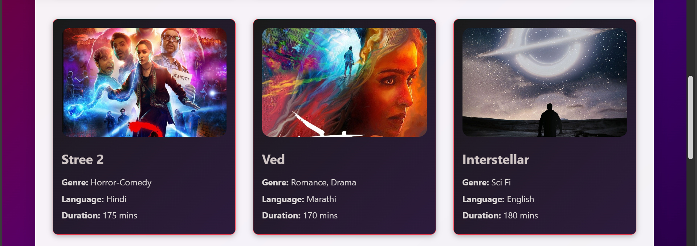
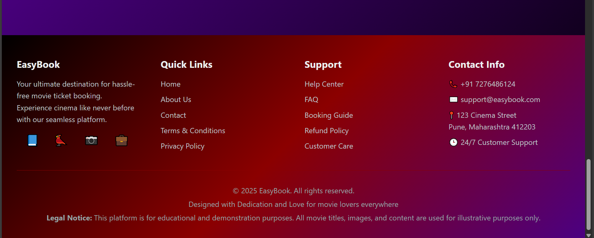

# EasyBook – Movie Ticket Booking System

EasyBook is a smart and user-friendly movie ticket booking system that allows users to easily select their **city**, choose a **movie**, pick a **theatre**, select a **showtime**, and book **seats**—all through a smooth and intuitive interface. 

💡 What makes EasyBook unique is **JAKSIA**, an integrated AI assistant that helps users with booking tickets and answers queries related to the platform in real-time.

---

## 🚀 Features

- 🎥 Browse and select movies based on city
- 🏢 View theatres and showtimes
- 🪑 Seat selection with availability display
- 💳 Secure payment integration
- ✅ Booking confirmation
- 🤖 **JAKSIA** – AI chatbot assistant for booking and help

---

## 🛠️ Tech Stack

- **Java 21**
- **Spring Boot v3.4.8**
- **HTML CSS JavaScript**
- **MySQL**
- **Razorpay Test Mode**

---

## 📦 Installation

1. **Clone the repository**
   ```bash
   git clone https://github.com/imjay05/easybook.git
   cd easybook
Build the project

./mvnw clean install
Run the application

./mvnw spring-boot:run
Open your browser and visit:

http://localhost:8080
Make sure you have Java 21 and Maven installed.

## 🧾 Database Schema

Here’s a breakdown of the main tables used in EasyBook:

### 🧑 users
| Column    | Type         | Constraints        |
|-----------|--------------|--------------------|
| user_id   | INT          | PK, AUTO_INCREMENT |
| name      | VARCHAR(50)  | NOT NULL           |
| email     | VARCHAR(50)  | NOT NULL           |
| phone     | VARCHAR(15)  | NOT NULL           |
| password  | VARCHAR(50)  | NOT NULL           |

---

### 🎥 movies
| Column    | Type         | Constraints        |
|-----------|--------------|--------------------|
| movie_id  | INT          | PK, AUTO_INCREMENT |
| title     | VARCHAR(50)  | UNIQUE             |
| gener     | VARCHAR(50)  |                    |
| lang      | VARCHAR(50)  |                    |
| duration  | INT          |                    |

---

### 🏢 theaters
| Column     | Type         | Constraints        |
|------------|--------------|--------------------|
| theater_id | INT          | PK, AUTO_INCREMENT |
| name       | VARCHAR(30)  | NOT NULL           |
| city       | VARCHAR(30)  | NOT NULL           |

---

### ⏰ shows
| Column         | Type         | Constraints        |
|----------------|--------------|--------------------|
| show_id        | INT          | PK, AUTO_INCREMENT |
| movie_id       | INT          | FK → movies        |
| theater_id     | INT          | FK → theaters      |
| timing         | VARCHAR(30)  |                    |
| available_seats| INT          |                    |

---

### 💺 seat
| Column      | Type         | Constraints        |
|-------------|--------------|--------------------|
| seat_id     | INT          | PK, AUTO_INCREMENT |
| show_id     | INT          | FK → shows         |
| seat_number | VARCHAR(10)  |                    |
| is_booked   | BOOLEAN      | DEFAULT FALSE      |

---

### 📦 bookings
| Column        | Type            | Constraints        |
|---------------|-----------------|--------------------|
| booking_id    | INT             | PK, AUTO_INCREMENT |
| user_id       | INT             | FK → users         |
| show_id       | INT             | FK → shows         |
| seats_booked  | VARCHAR(50)     |                    |
| total_price   | DECIMAL(10, 2)  |                    |

---

### 💰 payment_order
| Column      | Type          | Constraints        |
|-------------|---------------|--------------------|
| id          | BIGINT        | PK, AUTO_INCREMENT |
| name        | VARCHAR(255)  |                    |
| email       | VARCHAR(255)  |                    |
| phone       | VARCHAR(20)   |                    |
| movie_name  | VARCHAR(50)   | FK → movies(title) |
| amount      | DOUBLE        |                    |
| order_id    | VARCHAR(255)  |                    |
| payment_id  | VARCHAR(255)  |                    |
| status      | VARCHAR(50)   |                    |
| created_at  | DATETIME      |                    |


## 🗺️ EER Diagram

Here's the EER diagram representing the database structure of EasyBook:


🖼️ UI Screenshots
Below are some key UI screens from the EasyBook platform.

🎬 Homepage
### 🎬 Homepage

Below is the homepage of the EasyBook platform:






🤝 Contribution
Contributions are welcome!
Fork the repo → Make changes → Submit a pull request.

📬 Contact
Created by Jay 
🔗 GitHub: @imjay05
🔗 Gmail : imjaydigambarshelke@gmail.com
🔗 Linkdin : https://www.linkedin.com/in/jay-shelke-4323a22a5/
